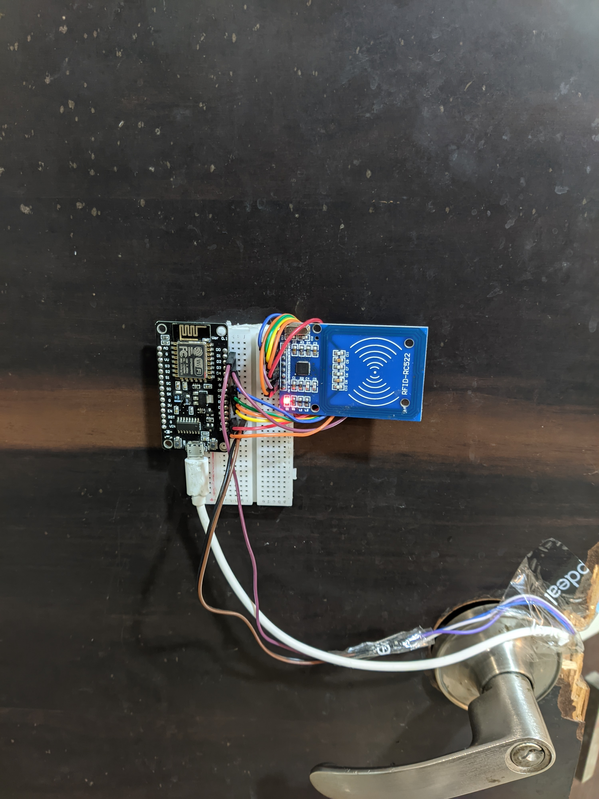

# SmartDoorLock
Smart RFID + WiFi-based door lock using Arduino, NodeMCU, and Blynk
# 🔐 Smart WiFi + RFID Door Lock

This is a smart and secure door lock system that uses **RFID authentication** and **WiFi-based remote control** via the **Blynk app**. The system combines an **Arduino UNO** (or Nano) and a **NodeMCU (ESP8266)** to control a **12V solenoid lock** through a **relay**.

This is ideal for home automation, secure lockers, or IoT-based access systems.

## 🔧 Features

- 🛡️ RFID-based access control
- 🌐 Remote lock/unlock via Blynk app (WiFi)
- 🔐 12V solenoid lock controlled by relay
- 🔄 Combination of Arduino + NodeMCU
- 🧠 Local + cloud control (offline RFID, online Blynk)
- 🔋 Powered by 12V supply (can be battery or adapter)

## 🧪 Technologies Used

- **Arduino UNO/Nano** – core logic and relay control
- **NodeMCU ESP8266** – handles WiFi & Blynk communication
- **Blynk IoT App** – smartphone control interface
- **RFID Module (RC522)** – user authentication
- **Relay Module** – electrical switch for solenoid
- **12V Solenoid Lock** – actual locking mechanism

## 🧰 Hardware Components

Here are the components required for building this project:

| Component              | Quantity | Description                          |
|------------------------|----------|--------------------------------------|
| Arduino UNO / Nano     | 1        | Main microcontroller for logic       |
| NodeMCU (ESP8266)      | 1        | WiFi communication + Blynk control   |
| RFID Reader (RC522)    | 1        | For scanning RFID cards/tags         |
| RFID Tags              | 2+       | Keychain or card format              |
| 12V Solenoid Lock      | 1        | Electromechanical locking device     |
| Relay Module           | 1        | To switch solenoid on/off            |
| 12V Adapter / Battery  | 1        | Power source for solenoid            |
| Jumper Wires           | Many     | For all connections                  |
| Breadboard / PCB       | 1        | For mounting and testing             |
| Optional: LED & Buzzer | 1 each   | For feedback (access granted/denied) |

## 💻 Software Setup

To get the code up and running, follow these steps:

### Arduino IDE Setup
1.  **Download and Install Arduino IDE:** If you don't have it, get it from the [official Arduino website](https://www.arduino.cc/en/software).
2.  **Install ESP8266 Board Manager (for NodeMCU):**
    * Go to `File > Preferences`.
    * In "Additional Boards Manager URLs," add: `http://arduino.esp8266.com/stable/package_esp8266com_index.json`
    * Go to `Tools > Board > Boards Manager...`. Search for `esp8266` and install the `esp8266 by ESP8266 Community` package.
3.  **Install Required Libraries:**
    * Go to `Sketch > Include Library > Manage Libraries...`.
    * Search for and install:
        * `Blynk by Volodymyr Shymanskyy`
        * `MFRC522 by Arduin-o-joy` (or a similar compatible RFID library like `MFRC522 by Seeed Studio`)

### Blynk App Configuration
1.  **Download Blynk App:** Get it from the Google Play Store or Apple App Store.
2.  **Create New Project:**
    * Open the app, create a new account or log in.
    * Create a "New Project" and select `ESP8266` as the device.
    * Note down the **Auth Token** displayed, as you'll need this for your NodeMCU code. This token will also be sent to your registered email.
3.  **Add Widgets:**
    * Add a **Button widget** to control the lock. Configure its output pin (e.g., `Virtual Pin V1`).
    * Add a **LED widget** or a **Value Display widget** to show the lock's current status (e.g., connected to `Virtual Pin V2`).

### Uploading Code

#### **1. Arduino Code (for RFID and Solenoid Lock Control)**

#### **2. NodeMCU Code (for WiFi & Blynk Integration)**

## 🔗 Circuit Diagram / Wiring

*Replace this with your actual circuit diagram image. You can use tools like Fritzing or draw it manually and take a photo.*

### Key Connections:

* **RFID RC522 to Arduino:**
    * SDA (SS) to Arduino D10
    * SCK to Arduino D13
    * MOSI to Arduino D11
    * MISO to Arduino D12
    * IRQ to Arduino D9 (Optional, for interrupt-driven reading)
    * GND to Arduino GND
    * 3.3V to Arduino 3.3V
* **Relay Module to Arduino/NodeMCU:**
    * `VCC` to 5V (from Arduino or external 5V supply)
    * `GND` to GND
    * `IN` to a digital pin (e.g., Arduino D7 or NodeMCU D1) – this pin will control the relay.
* **12V Solenoid Lock to Relay:**
    * Connect one terminal of the 12V solenoid lock to the `NO` (Normally Open) or `NC` (Normally Closed) terminal of the relay, depending on desired default state (e.g., `NO` for normally unlocked).
    * Connect the other terminal of the solenoid lock to the `+` output of your 12V power supply.
    * Connect the `COM` (Common) terminal of the relay to the `-` (ground) of your 12V power supply. (Alternatively, connect one solenoid wire to `COM` and the 12V+ to `NO`/`NC` with the other solenoid wire connected to ground. Consult your specific relay module's instructions.)
* **Arduino and NodeMCU Interconnection (if necessary):**
    * If Arduino and NodeMCU communicate directly, use Serial communication (Arduino TX to NodeMCU RX, Arduino RX to NodeMCU TX) or I2C/SPI as needed. Ensure common ground.
* **Powering:**
    * Arduino can be powered via USB or its DC Jack (7-12V).
    * NodeMCU can be powered via USB.
    * **Crucially, the 12V Solenoid Lock MUST be powered by a separate 12V supply via the relay, not directly from the microcontrollers.**

## 🚀 How to Use

Once the hardware is connected and the code is uploaded:

1.  **RFID Authentication:** Simply tap an authorized RFID card or keychain tag against the RC522 reader. The lock will engage or disengage based on the programmed logic (e.g., toggle, or unlock only for specific tags).
2.  **Blynk Remote Control:**
    * Ensure your NodeMCU is connected to WiFi and the Blynk server (check the connection status in the Blynk app).
    * Use the button widget you configured in the Blynk app to remotely toggle the lock state.
    * Observe the LED/Value Display widget in the app for real-time status of the lock.

---

## 📸 Photos and Videos

### Videos

[SmartDoorLock Demo Video](smart_doorlock_media/VID_20210916_215517.mp4)

[SmartDoorLock Demo Video](smart_doorlock_media/PXL_20220128_143609936~3.mp4)
